## Système de débriefing pédagogique des briefs – Laravel

## Description
Ce projet est un **système interne de débriefing pédagogique** développé avec Laravel. Il permet de structurer, suivre et analyser les briefs pédagogiques, les compétences et les niveaux atteints par les apprenants.  

Il remplace le suivi manuel actuel pour offrir :

- Une meilleure traçabilité des évaluations.
- Une analyse précise de la progression des apprenants.
- Une gestion centralisée des classes, sprints et briefs.

---

## Technologies utilisées

**Backend :**

- PHP 8.2-fpm
- Laravel (MVC)
- Eloquent ORM
- Authentification Laravel (sessions)
- Middleware & Policies (gestion des rôles)
- Validation des données

**Frontend :**

- Blade (Template Engine)
- HTML / Tailwind CSS

**Base de données :**

- PostgreSQL
- Enum PHP pour les niveaux de compétences

**Autres outils :**

- UML pour la conception (Use Case & Diagrammes de classes)
- Migrations Laravel

---

## Fonctionnalités principales

### Gestion pédagogique

- Création et gestion des **classes**, avec affectation des apprenants et formateurs.
- Organisation des classes en **sprints** avec ordre chronologique.
- Gestion des **briefs** : titre, description, durée, type (individuel/collectif) et compétences ciblées.
- Gestion des **compétences** avec code, libellé et niveaux de maîtrise (`IMITER`, `S’ADAPTER`, `TRANSPOSER`).

### Débriefing pédagogique

- Sélection du brief et de l’apprenant.
- Évaluation des compétences liées au brief.
- Association d’un **niveau de maîtrise** pour chaque compétence.
- Ajout de **commentaires pédagogiques**.
- Historique des débriefings consultable par apprenant et formateur.

### Consultation & suivi

**Apprenant :**

- Consulter les briefs réalisés.
- Consulter ses compétences évaluées.
- Visualiser sa progression par compétence.

**Formateur :**

- Consulter la progression d’un apprenant.
- Consulter la progression globale d’une classe.

### Règles métier

- Un apprenant appartient à une seule classe.
- Une classe possède plusieurs sprints.
- Un sprint contient plusieurs briefs.
- Un brief peut cibler plusieurs compétences.
- Une compétence peut être évaluée dans plusieurs briefs.
- Une évaluation est liée à un apprenant, un brief, une compétence et un niveau de maîtrise.

---

## Installation & Configuration

1. Cloner le dépôt :
```bash
git clone https://github.com/elgmouriabderrahim/debriefing-system-laravel.git
cd debriefing-system-laravel
```

2. Installer les dépendances Laravel :
```bash
composer install
```

3. Copier le fichier .env.example et configurer votre base de données PostgreSQL :
```bash
cp .env.example .env
php artisan key:generate
```
4. Exécuter les migrations :
```bash
php artisan migrate
```

5. Accéder à l’application dans votre navigateur :  
http://localhost:8000


## screenshots

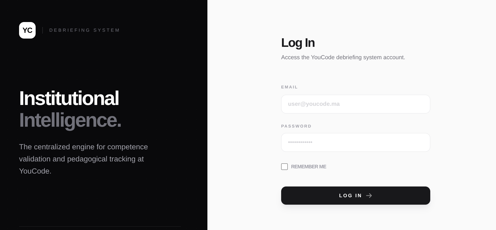

**admin**

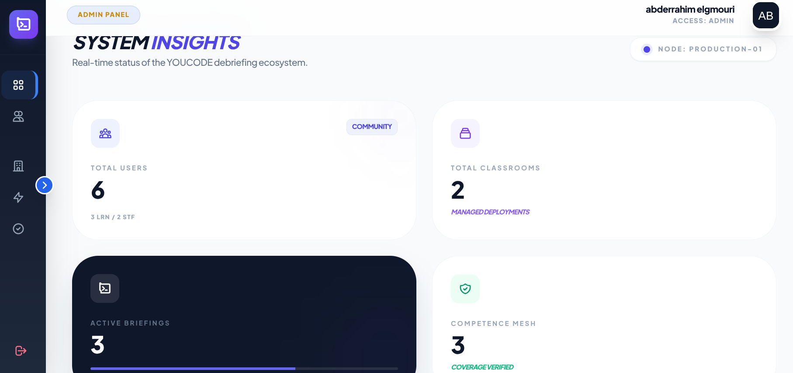
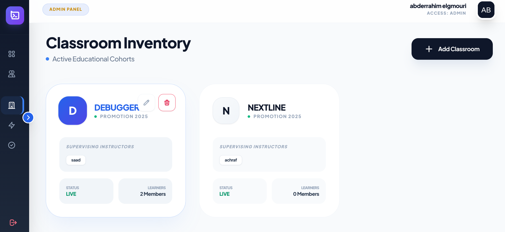
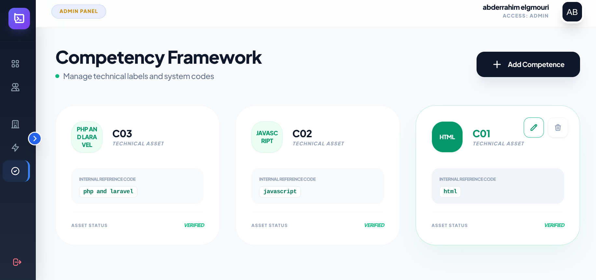
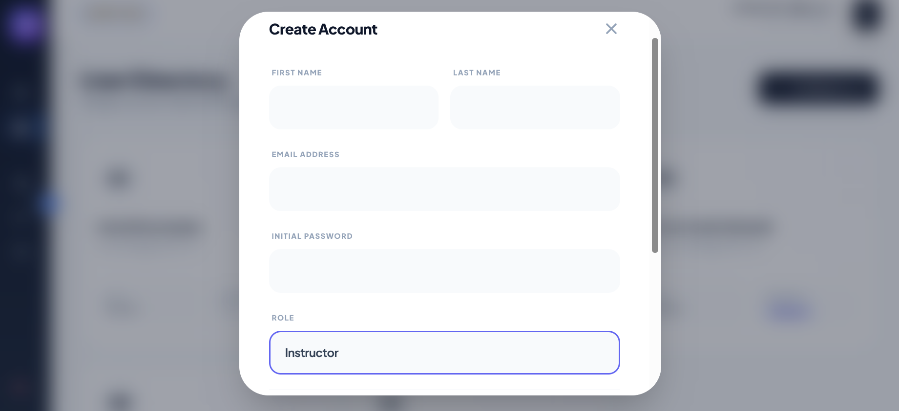
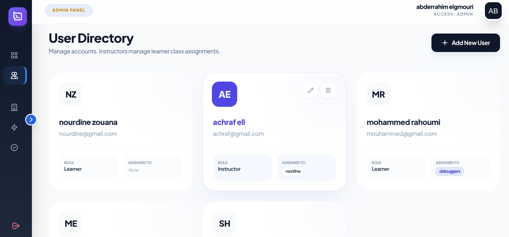


**instructor**

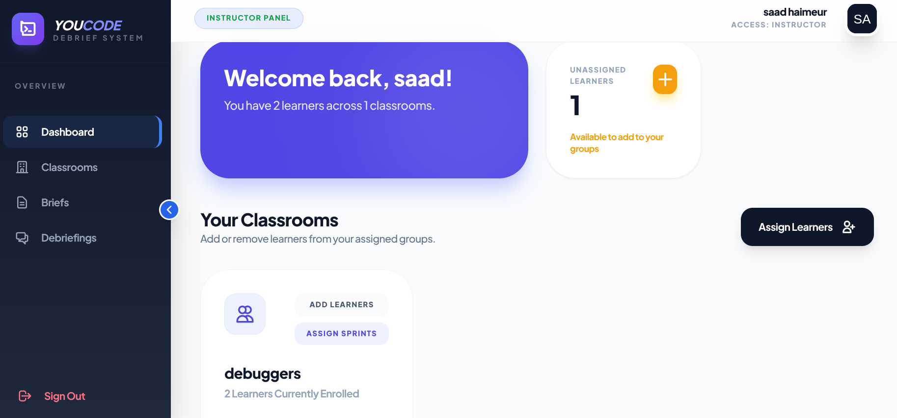
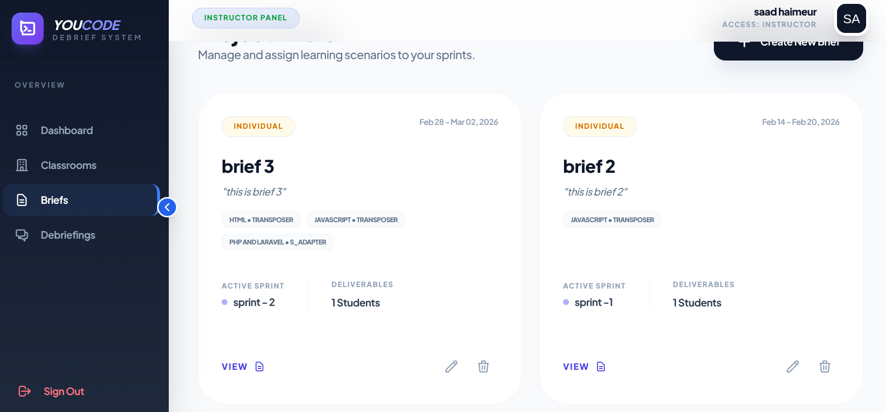
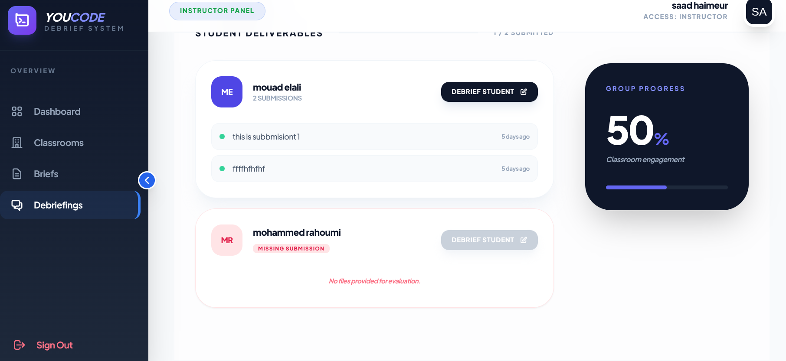
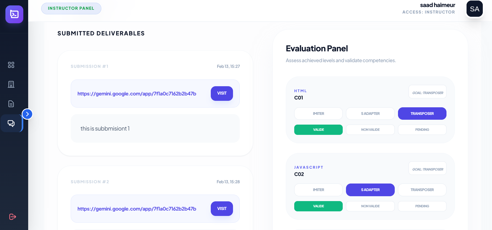
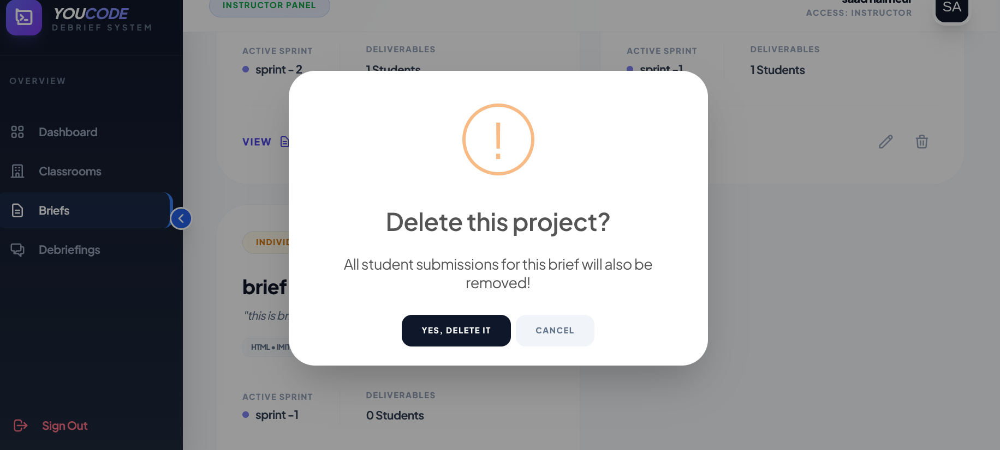
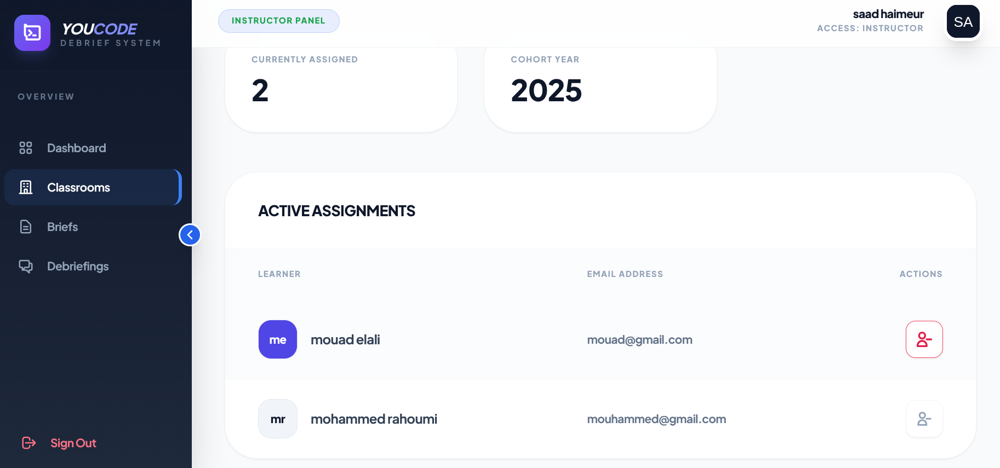


**learner**

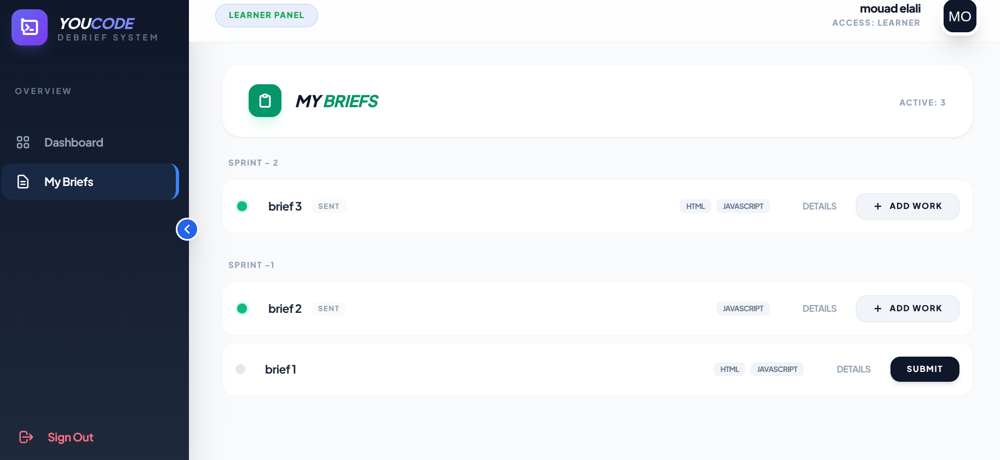
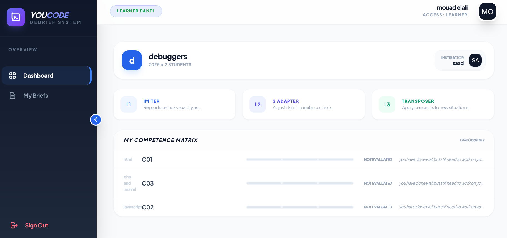